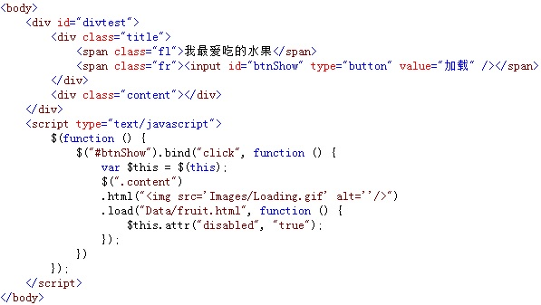

# 使用load()方法异步请求数据 


使用 `load()` 方法通过 `Ajax` 请求加载服务器中的数据，并把返回的数据放置到指定的元素中，它的调用格式为：

```js
load(url,[data],[callback])
```

参数 `url` 为加载服务器地址，可选项 `data` 参数为请求时发送的数据，`callback` 参数为数据请求成功后，执行的回调函数。

例如，点击“ **加载** ”按钮时，向服务器请求加载一个指定页面的内容，加载成功后，将数据内容显示在 `<div>` 元素中，并将加载按钮变为不可用。如下图所示：



在浏览器中显示的效果：


从图中可以看出，当点击“加载”按钮时，通过调用 `load()` 方法向服务器请求加载 `fruit.html` 文件中的内容，当加载成功后，先显示数据，并将按钮变为不可用。

