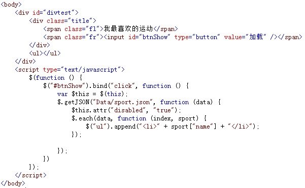
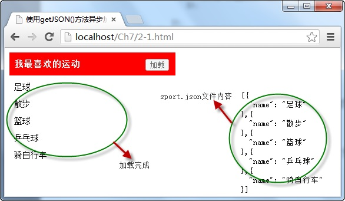

# 使用getJSON()方法异步加载JSON格式数据 


使用 `getJSON()` 方法可以通过 Ajax 异步请求的方式，获取服务器中的数据，并对获取的数据进行解析，显示在页面中，它的调用格式为：

```js
jQuery.getJSON(url,[data],[callback])
// or
$.getJSON(url,[data],[callback])
```

其中， `url` 参数为请求加载 json 格式文件的服务器地址，可选项 `data` 参数为请求时发送的数据，`callback` 参数为数据请求成功后，执行的回调函数。

例如，点击页面中的“ **加载** ”按钮，调用 `getJSON()` 方法获取服务器中 JSON 格式文件中的数据，并遍历数据，将指定的字段名内容显示在页面中。如下图所示：



在浏览器中显示的效果：



从图中可以看出，当点击“ **加载** ”按钮时，通过 `getJSON()` 方法调用服务器中的 `sport.json` 文件，获取返回的 `data` 文件数据，并遍历该数据对象，以 `data[“name”]` 取出数据中指定的内容，显示在页面中。

