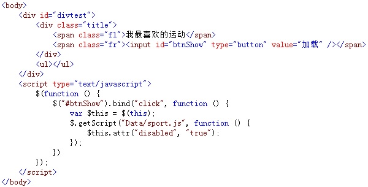
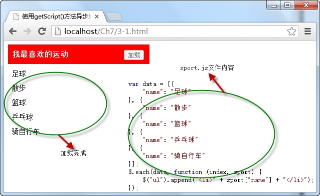

# 使用getScript()方法异步加载并执行js文件 


使用 `getScript()` 方法异步请求并执行服务器中的 `JavaScript` 格式的文件，它的调用格式如下所示：

```js
jQuery.getScript(url,[callback])
// or
$.getScript(url,[callback])
```

参数 `url` 为服务器请求地址，可选项 `callback` 参数为请求成功后执行的回调函数。

例如，点击“ **加载** ”按钮，调用 `getScript()` 加载并执行服务器中指定名称的 JavaScript 格式的文件，并在页面中显示加载后的数据内容，如下图所示：



在浏览器中显示的效果：



从图中可以看出，当点击“ **加载** ”按钮调用 `getScript()` 方法加载服务器中的 JavaScript 格式文件后，自动执行文件代码，将数据内容显示在 `<ul>` 元素中。

