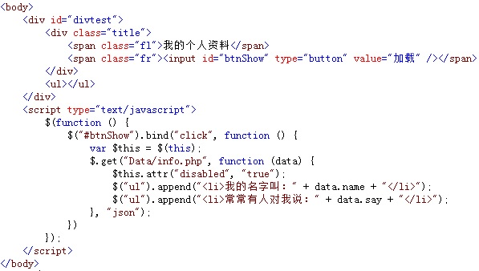
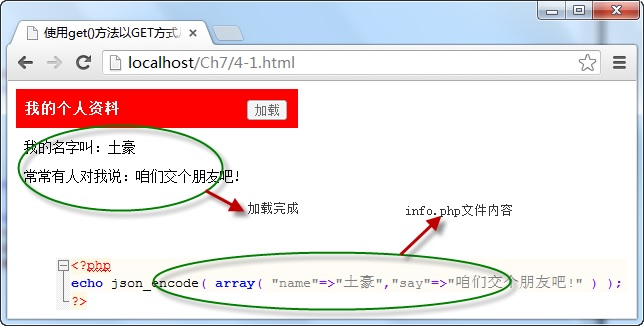

# 使用get()方法以GET方式从服务器获取数据 


使用 `get()` 方法时，采用 GET 方式向服务器请求数据，并通过方法中回调函数的参数返回请求的数据，它的调用格式如下：

```js
$.get(url,[callback])
```

参数 `url` 为服务器请求地址，可选项 `callback` 参数为请求成功后执行的回调函数。

例如，当点击“ **加载** ”按钮时，调用 `get()` 方法向服务器中的一个 `.php` 文件以 `GET` 方式请求数据，并将返回的数据内容显示在页面中，如下图所示：



在浏览器中显示的效果：



从图中可以看出，通过 `$.get()` 方法向服务器成功请求数据后，在回调函数中通过 `data` 参数传回请求的数据，并以 `data.name` 格式访问数据中各项的内容。

