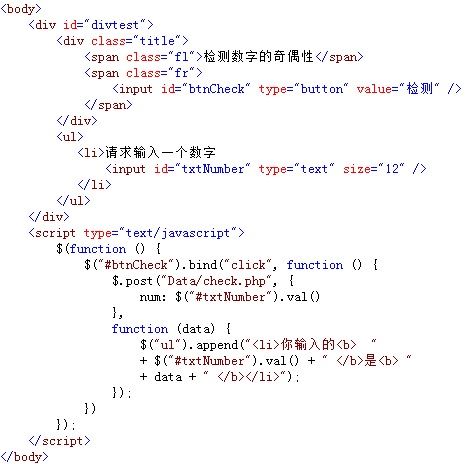
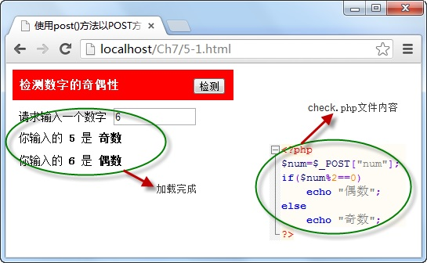

# 使用post()方法以POST方式从服务器发送数据

与 `	get()` 方法相比，`post()` 方法多用于以 `POST` 方式向服务器发送数据，服务器接收到数据之后，进行处理，并将处理结果返回页面，调用格式如下：

```js
$.post(url,[data],[callback])
```

参数 `url` 为服务器请求地址，可选项 `data` 为向服务器请求时发送的数据，可选项 `callback` 参数为请求成功后执行的回调函数。

例如，在输入框中录入一个数字，点击“ **检测** ”按钮，调用 `post()` 方法向服务器以 `POST` 方式发送请求，检测输入值的奇偶性，并显示在页面中，如下图所示：



在浏览器中显示的效果：



从图中可以看出，当点击“ **检测** ”按钮时，获取输入框中的值，并将该值使用 `$.post()` 方法一起发送给服务器，服务器接收该值后并进行处理，最后返回处理结果。

