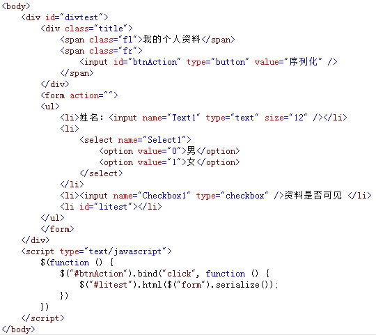
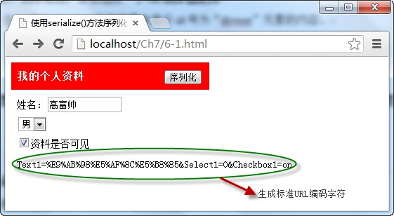

# 使用serialize()方法序列化表单元素值

使用 `serialize()` 方法可以将表单中有 `name` 属性的元素值进行序列化，生成标准 `URL` 编码文本字符串，直接可用于 `ajax` 请求，它的调用格式如下：

```js
$(selector).serialize()
```

其中 `selector` 参数是一个或多个表单中的元素或表单元素本身。

例如，在表单中添加多个元素，点击“ **序列化** ”按钮后，调用 `serialize()` 方法，将表单元素序列化后的标准URL编码文本字符串显示在页面中，如下图所示：



在浏览器中显示的效果：



从图中可以看出，当点击“ **序列化** ”按钮后，调用表单元素本身的 `serialize()` 方法，将表单中元素全部序列化，生成标准 `URL` 编码，各元素间通过 `&` 号相联。
