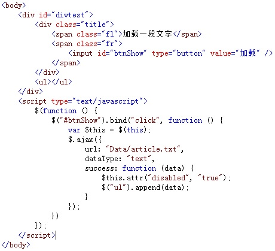
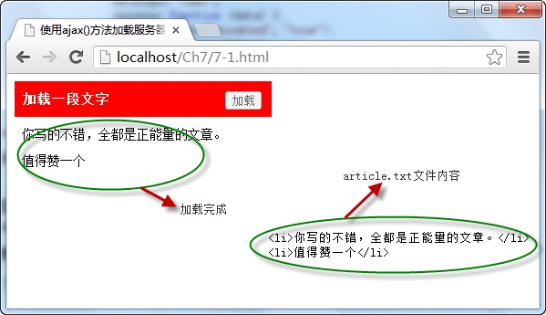

# 使用ajax()方法加载服务器数据

使用 `ajax()` 方法是最底层、功能最强大的请求服务器数据的方法，它不仅可以获取服务器返回的数据，还能向服务器发送请求并传递数值，它的调用格式如下：

```js
jQuery.ajax([settings])
// or
$.ajax([settings])
```

其中参数 `settings` 为发送 `ajax` 请求时的配置对象，在该对象中，`url` 表示服务器请求的路径，`data` 为请求时传递的数据， `dataType`为服务器返回的数据类型，`success` 为请求成功的执行的回调函数，`type` 为发送数据请求的方式，默认为 `get` 。

例如，点击页面中的“ **加载** ”按钮，调用 `ajax()` 方法向服务器请求加载一个 `txt` 文件，并将返回的文件中的内容显示在页面，如下图所示：



在浏览器中显示的效果：



从图中可以看出，当点击“ **加载** ”按钮时，调用 `$.ajax()` 方法请求服务器中 `txt` 文件，当请求成功时调用 `success` 回调函数，获取传回的数据，并显示在页面中。

