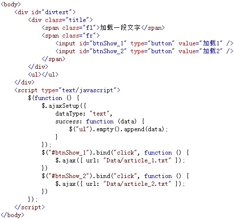
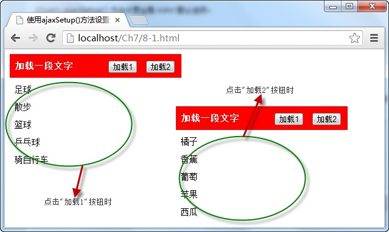

# 使用ajaxSetup()方法设置全局Ajax默认选项 

使用 `ajaxSetup()` 方法可以设置 Ajax 请求的一些全局性选项值，设置完成后，后面的 Ajax 请求将不需要再添加这些选项值，它的调用格式为：

```js
jQuery.ajaxSetup([options])
// or
$.ajaxSetup([options])
```

可选项 `options` 参数为一个对象，通过该对象设置 Ajax 请求时的全局选项值。

例如，先调用 `ajaxSetup()` 方法设置全局的 Ajax 选项值，再点击两个按钮，分别使用 `ajax()`方法请求不同的服务器数据，并将数据内容显示在页面，如下图所示：



在浏览器中显示的效果：



从图中可以看出，使用 `ajaxSetup()` 方法设置了 Ajax 请求时的一些全局性的配置选项后，在两次调用 `ajax` 请求服务器 `txt` 文件时，只需要设置 `url` 地址即可。

