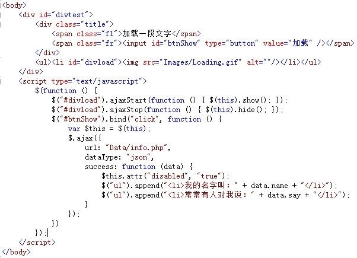
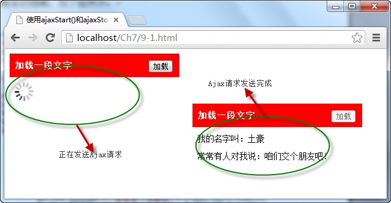

# 使用ajaxStart()和ajaxStop()方法 


`ajaxStart()` 和 `ajaxStop()` 方法是绑定 Ajax 事件。 `ajaxStart()` 方法用于在 Ajax 请求发出前触发函数， `ajaxStop()` 方法用于在 Ajax 请求完成后触发函数。它们的调用格式为：

```js
$(selector).ajaxStart(function())
// and
$(selector).ajaxStop(function())
```

其中，两个方法中括号都是绑定的函数，当发送 Ajax 请求前执行 `ajaxStart()` 方法绑定的函数，请求成功后，执行 `ajaxStop()` 方法绑定的函数。

例如，在调用 `ajax()` 方法请求服务器数据前，使用动画显示正在加载中，当请求成功后，该动画自动隐藏，如下图所示：



在浏览器中显示的效果：



从图中可以看出，由于使用 `ajaxStart()` 和 `ajaxStop()` 方法绑定了动画元素，因此，在开始发送 Ajax 请求时，元素显示，请求完成时，动画元素自动隐藏。

_注意：该方法在1.8.2下使用是正常的_

