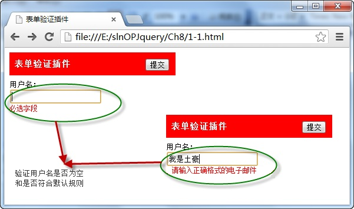

# 表单验证插件——validate 

> <a href="https://jqueryvalidation.org">官网</a>  
> <a href="https://jqueryvalidation.org/documentation">官方文档</a>

该插件自带包含必填、数字、URL在内容的验证规则，即时显示异常信息，此外，还允许自定义验证规则，插件调用方法如下：

```js
$(form).validate({options})
```

其中 `form` 参数表示表单元素名称，`options` 参数表示调用方法时的配置对象，所有的验证规则和异常信息显示的位置都在该对象中进行设置。

例如，当点击表单中的“ **提交** ”按钮时，调用 `validate` 插件验证用户名输入是否符合规则，并将异常信息显示在页面中，如下图所示：


在浏览器中显示的效果：



从图中可以看出，在页面中导入了 `validate` 插件，当用户在输入框中录入用户名时，自动根据规则进入验证，并显示提示信息，验证成功后，表单才能提交。

