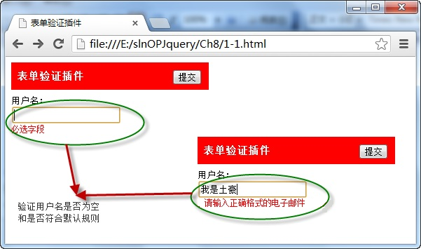

# 表单插件——form 

> <a href="http://malsup.com/jquery/form/"> 网址1 </a>
> <a href="http://jquery.malsup.com/form/"> 网址2 </a>


通过表单 `form` 插件，调用 `ajaxForm()` 方法，实现 ajax 方式向服务器提交表单数据，并通过方法中的 `options` 对象获取服务器返回数据，调用格式如下：

```js
$(form).ajaxForm({options})
```

其中 `form` 参数表示表单元素名称； `options` 是一个配置对象，用于在发送 ajax 请求过程，设置发送时的数据和参数。

例如，在页面中点击“ **提交** ”按钮，调用 form 插件的 `ajaxForm()`方法向服务器发送录入的用户名和密码数据，服务器接收后返回并显示在页面中，如下图所示：


在浏览器中显示的效果：



从图中可以看出，当点击“ **提交** ”按钮时，调用 form 表单插件中的 `ajaxForm()` 方法向指定的服务器以 ajax 方式发送数据，服务器接收后返回并将数据显示。

