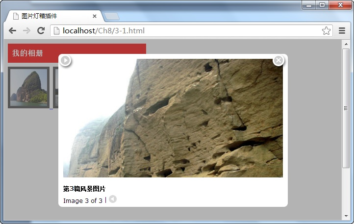

# 图片灯箱插件——lightBox 


该插件可以用圆角的方式展示选择中的图片，使用按钮查看上下张图片，在加载图片时自带进度条，还能以自动播放的方式浏览图片，调用格式如下：

```js
$(linkimage).lightBox({options})
```

其中 `linkimage` 参数为包含图片的 `<a>` 元素名称， `options` 为插件方法的配置对象。

例如，以列表的方式在页面中展示全部的图片，当用户单击其中某张图片时，通过引入的图片插件，采用“灯箱”的方式显示所选的图片，如下图所示：


在浏览器中显示的效果：



从图中可以看出，当用户点击“ **我的相册** ”中某一张图片时，则采用“灯箱”的方式显示选中图片，在显示图片时，还可以切换上下张和自动播放及关闭图片。

