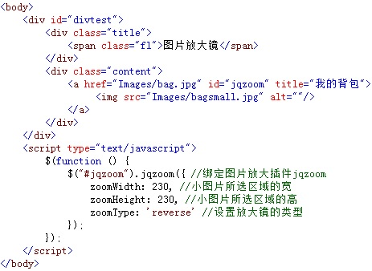
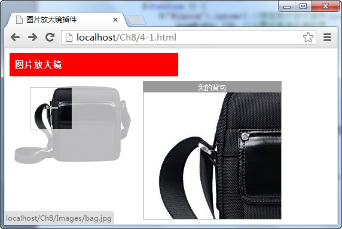

# 图片放大镜插件——jqzoom 

在调用 `jqzoom` 图片放大镜插件时，需要准备一大一小两张一样的图片，在页面中显示小图片，当鼠标在小图片中移动时，调用该插件的 `jqzoom()` 方法，显示与小图片相同的大图片区域，从而实现放大镜的效果，调用格式如下：

```js
$(linkimage).jqzoom({options})
```

其中 `linkimage` 参数为包含图片的 `<a>` 元素名称，`options` 为插件方法的配置对象。

例如，在页面中，添加一个被 `<a>` 元素包含的图片元素，当在图片元素中移动鼠标时，在图片的右边，将显示放大后的所选区域效果，如下图所示：



在浏览器中显示的效果：



从图中可以看出，当在小图片中移动鼠标时，将调用放大镜插件的 `jqzoom()` 方法，在图片的右侧显示与小图片所选区域相同的放大区域，实现放大镜的效果。

