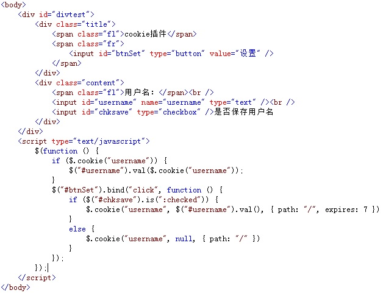
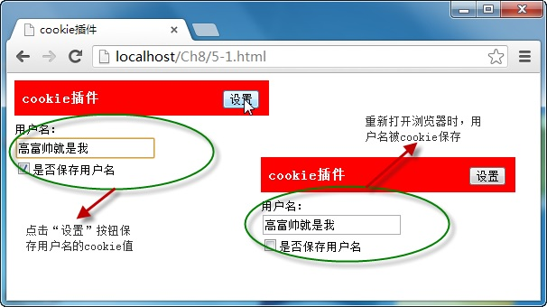

# cookie插件——cookie 

使用 `cookie` 插件后，可以很方便地通过 **cookie对象保存、读取、删除** 用户的信息，还能通过 `cookie` 插件保存用户的浏览记录，它的调用格式为：

```js
// 保存：
$.cookie(key, value)
// 读取：
$.cookie(key)
// 删除：
$.cookie(key, null)
```

其中参数 `key` 为保存 `cookie` 对象的名称，`value` 为名称对应的 `cookie` 值。

例如，当点击“ **设置** ”按钮时，如果是“ **否保存用户名** ”的复选框为选中状态时，则使用 `cookie` 对象保存用户名，否则，删除保存的 `cookie` 用户名，如下图所示：



在浏览器中显示的效果：



从图中可以看出，由于在点击“ **设置** ”按钮时，选择了保存用户名，因此，输入框中的值被 `cookie` 保存，下次打开浏览器时，直接获取并显示保存的 `cookie` 值。

