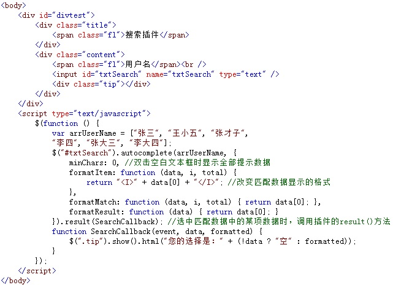
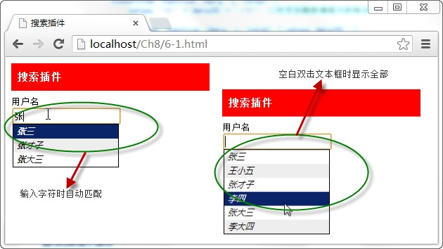

# 搜索插件——autocomplete 


搜索插件的功能是通过插件的 `autocomplete()` 方法与文本框相绑定，当文本框输入字符时，绑定后的插件将返回与字符相近的字符串提示选择，调用格式如下：

```js
$(textbox).autocomplete(urlData,[options]);
```

其中，`textbox` 参数为文本框元素名称， `urlData` 为插件返回的相近字符串数据，可选项参数 `options` 为调用插件方法时的配置对象。

例如，当用户在文本框输入内容时，调用搜索插件的 `autocomplete()` 方法返回与输入内容相匹配的字符串数据，显示在文本框下，提示选择，如下图所示：



在浏览器中显示的效果：



从图中可以看出，当文本框与搜索插件相绑定后，输入任意字符时，都将返回与之相匹配的字符串，提示用户选择，文本框在空白双击时，显示全部提示信息。

