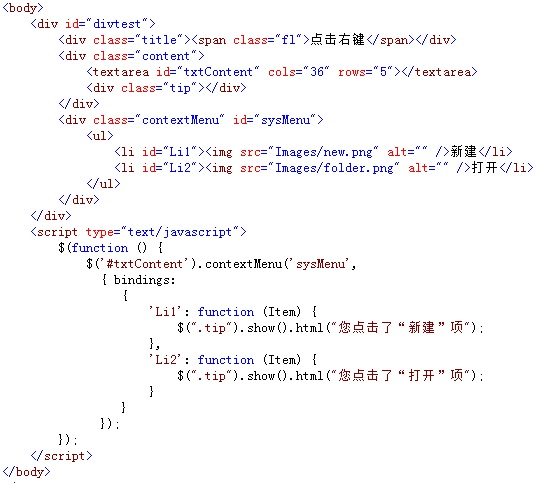
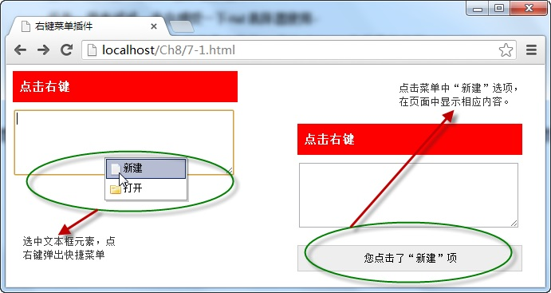

# 右键菜单插件——contextmenu 


右键菜单插件可以绑定页面中的 **任意元素，绑定后，选中元素，点击右键，** 便通过该插件弹出一个快捷菜单，点击菜单各项名称执行相应操作，调用代码如下：

```js
$(selector).contextMenu(menuId,{options});
```

`Selector` 参数为绑定插件的元素，`meunId` 为快捷菜单元素，`options` 为配置对象。

例如，选中页面 `<textarea>` 元素，点击右键，弹出插件绑定的快捷菜单，点击菜单中的各个选项，便在页面中显示操作的对应名称。如下图所示：



在浏览器中显示的效果：



从图中可以看出，当文本框与右键菜单通过插件 `contextmenu()` 方法绑定后，选中文本框，点击右键时，弹出快捷菜单，点击“ **新建** ”选项时，显示操作对应内容。

