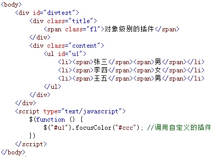
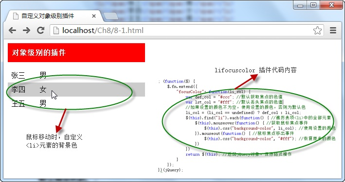

# 自定义对象级插件——lifocuscolor插件 


自定义的 `lifocuscolor` 插件可以在 `<ul>` 元素中，鼠标在表项 `<li>` 元素移动时，自定义其获取焦点时的背景色，即定义 `<li>`元素选中时的背景色，调用格式为：

```js
$(Id).focusColor(color)
```

其中，参数 `Id` 表示 `<ul>` 元素的 `Id` 号， `color` 表示 `<li>` 元素选中时的背景色。

例如，在页面中，调用自定义的 `lifocuscolor` 插件，自定义 `<li>` 元素选中时的背景色，如下图所示：



在浏览器中显示的效果：



从图中可以看出，当`<ul>`元素调用 `focusColor()` 方法绑定自定义的插件之后，当鼠标在 `<li>` 元素间移动时，显示自定义的背景色。


> lifocuscolor插件 源码

```js
 /*------------------------------------------------------------/
功能：设置列表中表项获取鼠标焦点时的背景色
参数：li_col【可选】 鼠标所在表项行的背景色
返回：原调用对象
示例：$("ul").focusColor("red");
/------------------------------------------------------------*/
;(function($) {
    $.fn.extend({
        "focusColor": function(li_col) {
            var def_col = "#ccc"; //默认获取焦点的色值
            var lst_col = "#fff"; //默认丢失焦点的色值
            //如果设置的颜色不为空，使用设置的颜色，否则为默认色
            li_col = (li_col == undefined) ? def_col : li_col;
            $(this).find("li").each(function() { //遍历表项<li>中的全部元素
                $(this).mouseover(function() { //获取鼠标焦点事件
                    $(this).css("background-color", li_col); //使用设置的颜色
                }).mouseout(function() { //鼠标焦点移出事件
                    $(this).css("background-color", "#fff"); //恢复原来的颜色
                })
            })
            return $(this); //返回jQuery对象，保持链式操作
        }
    });
})(jQuery);
```