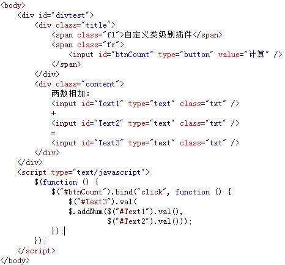
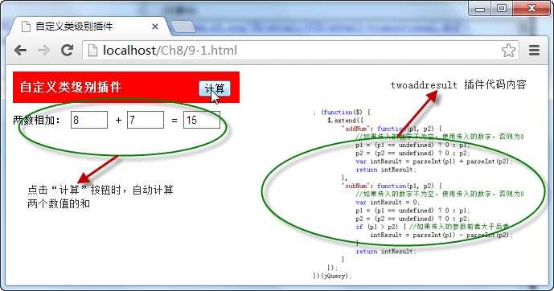

# 自定义类级别插件——twoaddresult 


通过调用自定义插件 `twoaddresult` 中的不同方法，可以实现对两个数值进行相加和相减的运算，导入插件后，调用格式分别为：

```js
$.addNum(p1,p2) 
// and
$.subNum(p1,p2)
```

上述调用格式分别为计算两数值相加和相减的结果，`p1` 和 `p2` 为任意数值。

例如，在页面的两个文本框中输入任意数值，点击“计算”按钮调用自定义插件中 `$.addNum()` 方法，计算两数值的和并将结果显示在另一文本框中，如下图所示：



在浏览器中显示的效果：



从图中可以看出，当点击“ **计算** ”按钮时，调用了自定义插件中的 `$.addNum()` 方法计算两个文本框中输入数值的和，并将该值显示在另一文本框中。

> twoaddresult 插件源码

```js
/*------------------------------------------------------------/
功能：计算二个数字相加或相减的结果
参数：数字p1,p2
返回：两数相加后的结果
示例：$.AddNum(1,2);
/------------------------------------------------------------*/
; (function($) {
    $.extend({
        "addNum": function(p1, p2) {
            //如果传入的数字不为空，使用传入的数字，否则为0
            p1 = (p1 == undefined) ? 0 : p1;
            p2 = (p2 == undefined) ? 0 : p2;
            var intResult = parseInt(p1) + parseInt(p2);
            return intResult;
        },
        "subNum": function(p1, p2) {
            //如果传入的数字不为空，使用传入的数字，否则为0
            var intResult = 0;
            p1 = (p1 == undefined) ? 0 : p1;
            p2 = (p2 == undefined) ? 0 : p2;
            if (p1 > p2) { //如果传入的参数前者大于后者
                intResult = parseInt(p1) - parseInt(p2);
            }
            return intResult;
        }
    });
})(jQuery);
```