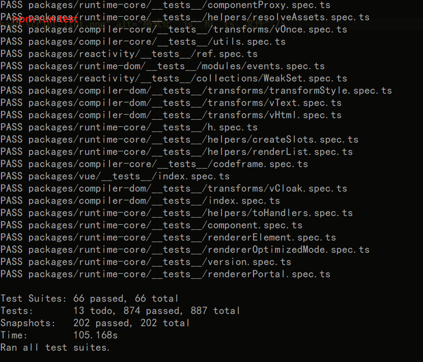
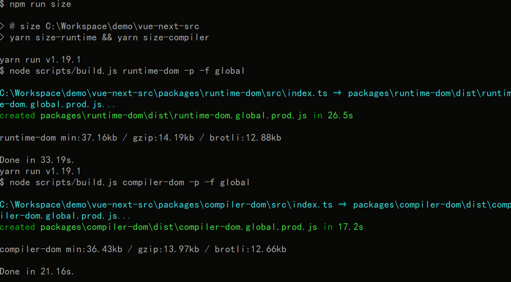

## 学习 package.json

先从看 `scripts` 开始学习

```json
"scripts": {
    "dev": "node scripts/dev.js",
    "build": "node scripts/build.js",
    "size-runtime": "node scripts/build.js runtime-dom -p -f global",
    "size-compiler": "node scripts/build.js compiler-dom -p -f global",
    "size": "yarn size-runtime && yarn size-compiler",
    "lint": "prettier --write --parser typescript \"packages/**/*.ts?(x)\"",
    "test": "jest"
  }
```

`scripts` 要到着看(由简单到困难)

### 运行 npm run test

> 使用 [jest](https://jestjs.io/docs/zh-Hans/getting-started) 单元测试




### 运行 npm run lint

> 使用 [prettier](https://prettier.io/) 格式化 `js` 和 `ts` 文件

`npm run lint` 运行了 `prettier --write --parser typescript \"packages/**/*.ts?(x)\"`, 使用 `prettier` 格式化 `js` 和 `ts` 文件


### 运行 npm run size

> `npm run size` 运行了 `yarn size-runtime && yarn size-compiler`

`size-runtime` 和 `size-compiler` 执行了 scripts/build.js 文件




